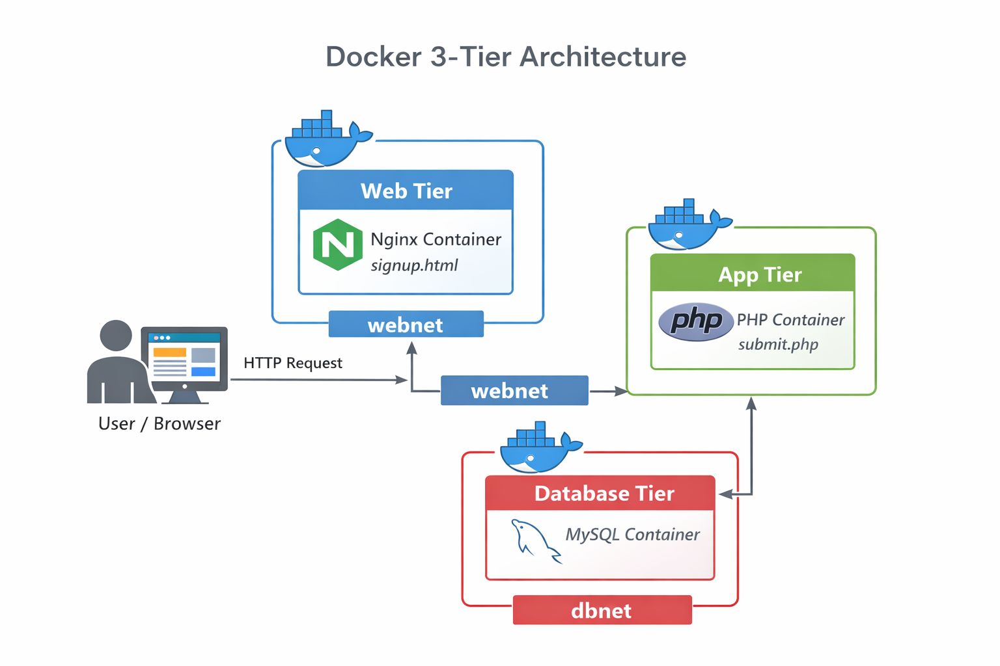
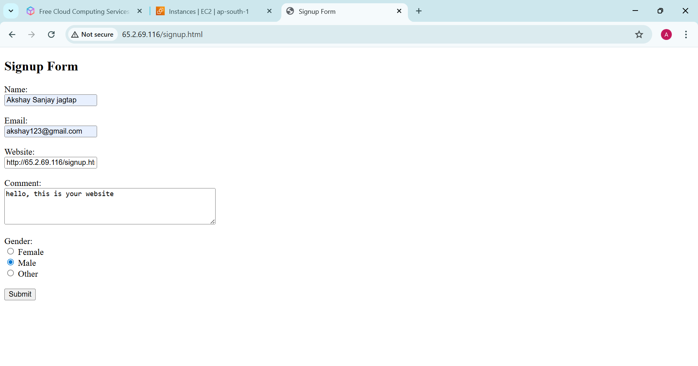
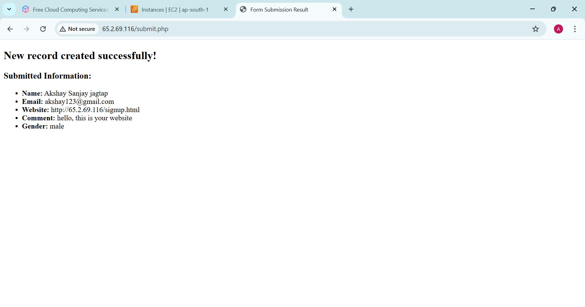
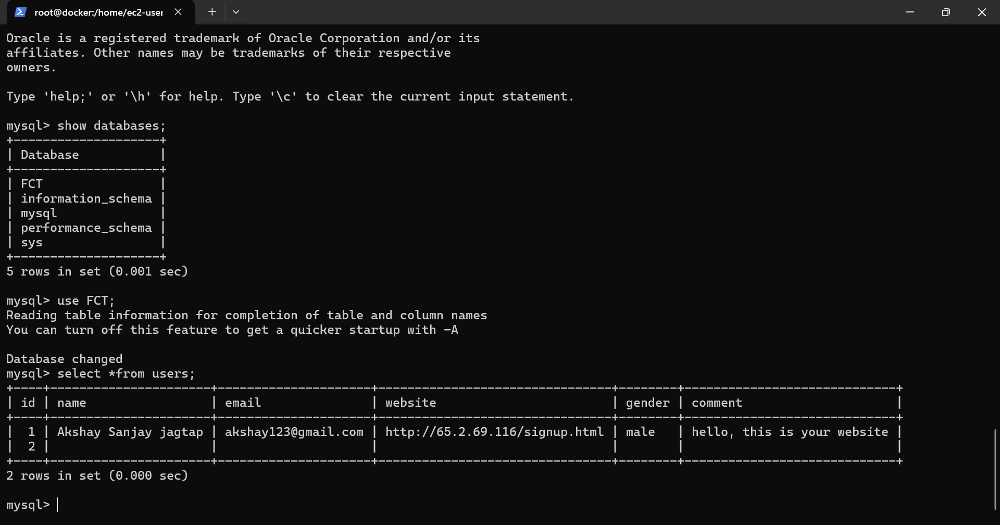

#  **Docker 3-Tier Architecture Project**

This project demonstrates a **3-Tier Architecture** using **Docker & Docker Compose**.  
The application is divided into **Web**, **Application**, and **Database** tiers, each running in separate containers and connected using Docker networks.

---

##  **Architecture Diagram**



> **Note:**  
> This diagram represents a Docker-based 3-Tier Architecture.  
> - The **Web container (Nginx)** serves frontend content and forwards requests to the App container using the `webnet` network.  
> - The **App container (PHP)** processes user requests and communicates with the Database container over the `dbnet` network.  
> - The **Database container (MySQL)** stores application data and is isolated from direct web access.

---

##  **Architecture Overview**

###  **Tiers Used:**

| Tier | Technology | Description |
|----|-----------|------------|
| Web Tier | Nginx | Serves frontend HTML |
| App Tier | PHP | Processes form data |
| DB Tier | MySQL | Stores user data |

---

### **Docker Networks:**

| Network | Purpose |
|------|--------|
| `webnet` | Web ↔ App communication |
| `dbnet` | App ↔ Database communication |

---

## **Project Directory Structure:**


```text
3tier/
│
├── docker-compose.yml
│
├── web/
│   ├── code/
│   │   └── signup.html
│   └── config/
│       └── default.conf
│
├── app/
│   └── code/
│       └── submit.php
│
└── db/
    ├── Dockerfile
    └── init.sql
```
## **Component Explanation (Step by Step):**

### **1. Web Tier (Nginx)**
**Location**: web/
#### **Files**:
* **signup.html**
* Frontend signup form
* Collects user input

<br>

* **default.conf**
* Nginx configuration
* Serves HTML files
* Forwards requests to App container

### **2. Application Tier (PHP)**
**Location**: app/code/
#### **Files**:
* **submit.php**
* Receives form data from signup.html
* Connects to MySQL database
* Inserts user data into table

### **3. Database Tier (MySQL)**
**Location**: db/
#### **Files**:
* **Dockerfile**
* Creates custom MySQL image
* Copies SQL initialization script

<br>

* **Init.sql**
* Creates database
* Creates required tables

### **docker-compose.yml Explanation:**
The **docker-compose.yml** file:

* Creates **3 containers**
  * **web**
  * **app**
  * **db**
* Creates **2 Docker networks**
  * **webnet**
  * **dbnet**
* Mounts volumes
* Handles container communication automatically

### **How to Run This Project (Step by Step):**
**Step 1: Install Required Tools**

Install **Docker**:
```bash
yum install docker -y
systemctl start docker
systemctl enable docker
systemctl status docker
```
Install **Docker-compose**:
```bash
1. Download the latest stable Docker Compose binary
sudo curl -L "https://github.com/docker/compose/releases/download/v2.29.7/docker-compose-$(uname -s)-$(uname -m)" -o /usr/local/bin/docker-compose

2. Make it executable
sudo chmod +x /usr/local/bin/docker-compose
```
**Step 2: Check Versions of Required Tools**
```bash
docker --version
docker-compose --version
```
**Step 3: Navigate to Project Directory**
```bash
cd 3tier/
```
**Step 4: Start Containers**
```bash
docker-compose up -d
```
**Step 5: Verify Containers**
```bash
docker ps
```
**Step 6: Access Application**
```bash
http://<public_ip>/signup.html
```
**Open browser and visit:**






### **Application Flow:**
**1**. user opens **signup.html**

**2**. Enters details

**3**. Form submits to **submit.php**

**4**. PHP processes data

**5**. Data stored in **MySQL database**

### **Useful Docker Commands:**
Stop containers:
```bash
docker-compose down
```
Rebuild containers:
```bash
docker-compose up -d --build
```
View logs:
```bash
docker-compose logs
```

### **Key Features:**
* Clean **3-Tier Architecture**
* Network isolation using Docker
* Database auto-initialization
* Easy deployment using Docker Compose
* Portfolio-ready project

### **Author:**
**Name**: Akshay Jagtap

**Project**: Docker 3-Tier Architecture